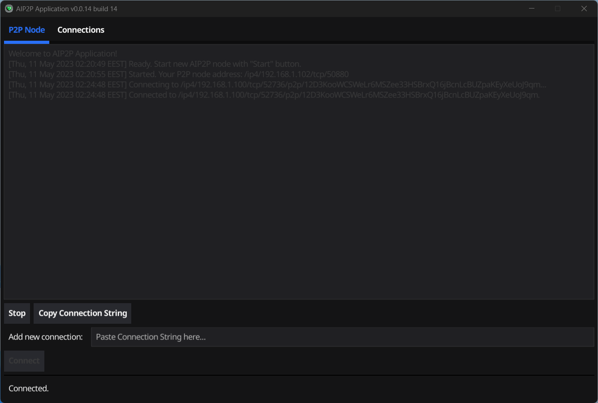

# AIP2P Application

[](https://pkg.go.dev/webimizer.dev/aip2p)

Mac OS version (screenshot)


[Download MacOS application (x64)](https://aip2p.app/downloads/aip2p.dmg)

Windows (64-bit)  version (screenshot)



[Download Windows setup (x64)](https://aip2p.app/downloads/Aip2pSetup.msi)

Distributed Artificial Intelligens protocol implementation base on [libp2p](https://libp2p.io). Peer(s) share CPU and GPU resources with each other and makes Distributed Neural Network (DNN).

## Setup steps:
1. Clone [this repository](https://webimizer.dev/aip2p)
2. Download Go from the [download page](https://go.dev/dl/) and follow instructions
3. Install fyne package:
```sh
go install fyne.io/fyne/v2/cmd/fyne@latest
```
4. Install AIP2P application to your computer with command:
```sh
fyne install
```